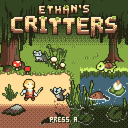

# Ethan's Critters

Walk a squire through one big swamp, break the six critter nests that have
turned it against you, then go through the brambles into The Rot and beat
the giant toad behind it all. The look is muddy, earthy and worn, and every
pixel of the swamp, the toad and the cutscenes is streamed off the SD card
while you play.

## Controls

| Button | Action |
|---|---|
| D-pad | Walk in eight directions. On the title: LEFT picks CONTINUE, RIGHT picks NEW GAME, UP or DOWN the other one |
| A | Thrust: the sword's swipe is a big arc in front of you, from over your head to under your feet, and it hits whatever is in it, a critter a little above or below you too. Right after a parry, a riposte that does double damage. On the title, start or take the choice; after a fall, get up; after the win, back to the title |
| B, held | Guard: blocks a blow from the front |
| B, tapped just before a blow | Parry: the attacker is stunned (the toad too, after its tongue's tell) |
| START | Pause: the map of the swamp; START again plays on |

## Rules

You have five hearts, lost in halves. Red mushrooms heal a little and white
ones a lot. Raccoons eat them if they get there first.

There are six nests: two raccoon dens, a turtle clutch, two beaver lodges
and a chameleon brood. While you are near a standing nest it keeps sending
critters out, one every few seconds; they come out above or below you and
run at you along that row before they close in level. Eight sword blows
break a nest, and once broken it stays cleared.

The willows are solid most of the way round: you can dip into the edge of
a canopy, never vanish behind one.

| Critter | Watch for |
|---|---|
| Raccoon | It rears up before it swipes: parry then. It steals mushrooms. |
| Turtle | It sleeps in the reeds, and a blow then does double damage. After two quick hits it hides in its shell. |
| Beaver | It dives and comes up beside you to bite. Beavers with sticks mend their lodge and throw the stick at you. |
| Chameleon | It fades out, creeps up as a shimmer, then shows itself and lashes its tongue after a pink tell. |
| Old Gullet, the giant toad | It hops at you, so step out of the shadow where it will land. When you stand level in front of it, it lashes its tongue: guard, or parry to stun it. At half its health it gets angry and calls up rot raccoons. |

Clear all six nests and The Rot stirs: its bramble gate opens. If you fall,
you wake at the hut with full hearts. Cleared nests stay cleared and the
mushrooms grow back.

## How to play

On the title, A starts. Once a nest has been cleared, the title offers
CONTINUE or NEW GAME. NEW GAME stands every nest up again, shuts the gate
and starts the clock from zero; the best time stays.

The compass on the HUD points to the nearest standing nest, then to The
Rot's gate. The pause map shows where you have been (the rest is fogged),
which nests are cleared and whether the gate is open. Beat the toad to see
the win clip with your time; the title keeps your best time, and CONTINUE
walks the swamp with The Rot healed.

The game saves the cleared nests, the gate, the toad, your time and the
map's fog when a nest falls, the gate opens, the toad dies and when you
pause.

The game reads its art from `CRITTERS.DAT` in the root of the SD card. The
first time it sees a new `CRITTERS.DAT` it reads the whole file once
(STIRRING THE SWAMP, about 20 seconds): a card is slow on its first read of
freshly copied data. To build it and put it on the board, see the project's
[BUILDING.md](../BUILDING.md). It needs the CHGame board
package ([Installing](https://github.com/bateske/CHGame#installing)).

For the handheld's SD game menu, download the game from the project's
[Releases](../../../releases/latest): the cart, `EthansCritters-<version>.chgame`,
or the zip that unzips onto a FAT32 card's root. From a clone,
`python EthansCritters/tools/export_cart.py` builds the cart (the release image, `CRITTERS.DAT`, the box art in
`docs/cart.png`, the licence), and `chgame cart deploy
EthansCritters.chgame --card E:\` from the CHGame repository's tools lays
out a card: the menu lists the game and installs it, and the file sits at
the card's root where the game reads it.

## Developer notes

- The swamp is one 1024x768 painted bitmap, not tiles
  (`tools/world/paint.py`). Each frame streams the 16-17 column blocks under
  the camera straight into the framebuffer in one card command
  (`src/engine/World.cpp`): 4.4 ms on the board. The bitmap is on the
  card in four ambient phases, so the reeds sway, the water ripples and
  The Rot's gnats buzz for free, and again healed: after the toad, The
  Rot comes back to life.
- Sprites come from a 3 KB frame cache filled from the card's sprite bank
  (`src/engine/Spool.cpp`) and are drawn with `gfx_blit4k`, a blitter added
  to CHGfx (patch P4) that flips, recolours and dithers at any x. Most are
  drawn while the world's blocks are still arriving: in the wait for each
  block, wherever the columns under them are already final
  (`src/game/Play.cpp`).
- The giant toad is half the screen tall and is never held in RAM: each
  frame streams its rows from the card and blits them as they arrive
  (`src/game/Rot.cpp`). Its red hit flash is a second copy on the card.
- The title loop, the death and win clips and the pause map are whole
  128x128 pictures, one per frame, with a 16-colour palette per clip
  (`src/engine/PathF.cpp`). `tools/card/clips.py` renders them offline
  from the world and the sprites, with dusk and dawn light and mist.
- The card and the panel share one SPI bus, so the card is read only
  between `gfx_wait()` and the next flush. The game draws at 60 fps and
  drops to 30 when a frame's work does not fit (`src/engine/Pace.h`).
- A card read that stalls loses only its frame (`src/engine/Card.h`): the
  stream gives up after 32 ms, the card is recovered, the frame is not
  sent (the panel keeps the last one) and the next frame tries again;
  after a second of that, or a card that does not answer, the card screen.
- On the board, most play draws at 60 fps. The world takes 4.4 ms of the
  8.2 ms each frame has after the flush, and a fight with 8 critters takes
  6.35 ms (7.1 ms in M5's build). The busiest scenes drop to 30 fps while
  the logic stays at 60 Hz.
  What the experiment found, measured and estimated, and what it means for
  the CHGame library, is in
  [docs/streaming-report.md](../docs/streaming-report.md).
- For changing the game, read [CLAUDE.md](../CLAUDE.md): the rules, the
  board's measured timings, the debug commands and the scripts.

## Credits

Game: Kevin Bates (bateske), written with Claude, under the MIT licence
([LICENSE](../LICENSE)). Libraries: CHGame,
CHGfx and CHSd by Kevin Bates (bateske), Apache-2.0 and MIT
(`../chgame/NOTICE`). Art: the sprite sheets and the swamp tileset in
`../Sprites/` (not in the repository: the packs are not ours to republish) are by Elthen, bought as sprite packs from
[elthen.itch.io](https://elthen.itch.io/). Ethan's Critters owes them its
name as well: "Elthen" was misread as "Ethan" when the sheets came in, and
the name stuck. The cover (`docs/cart.png`, drawn by `tools/cart.py` with
CHGame's artkit) is the game's own art and the title screen's own lettering.
