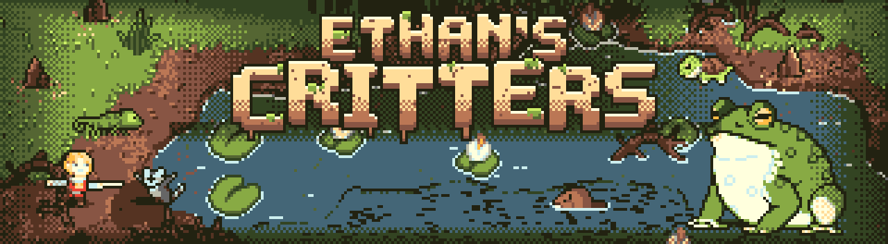

<h3>A swamp adventure for the CHGame handheld, streamed off the SD card every frame</h3>

  A squire, one big swamp, six critter nests and a giant toad. 
  44 MB of hand-painted world and animation on a 48 MHz RISC-V with 20 KB of RAM.

[![Release][release-shield]][release-url] [![Stars][stars-shield]][stars-url] [![Forks][forks-shield]][forks-url] [![Issues][issues-shield]][issues-url] [![MIT License][license-shield]][license-url]

[![Platform][platform-shield]][chgame-url] [![Frame rate][fps-shield]](#how-it-works) [![Card data][card-shield]](#how-it-works) [![Flash][flash-shield]](#how-it-works) [![RAM][ram-shield]](#how-it-works)

  <a href="https://github.com/bateske/EthansCritters/releases/latest"><strong>Download the game »</strong></a>
   
   
  <a href="EthansCritters/README.md">How to play</a>
  ·
  <a href="docs/streaming-report.md">The streaming report</a>
  ·
  <a href="BUILDING.md">Building it</a>
  ·
  <a href="https://github.com/bateske/EthansCritters/issues/new?labels=bug">Report a bug</a>

  
<strong>Table of contents</strong>

  <ol>
    <li><a href="#about-the-game">About the game</a>
      <ul>
        <li><a href="#controls">Controls</a></li>
        <li><a href="#features">Features</a></li>
        <li><a href="#built-with">Built with</a></li>
      </ul>
    </li>
    <li><a href="#getting-started">Getting started</a></li>
    <li><a href="#how-it-works">How it works</a></li>
    <li><a href="#the-library-patches">The library patches</a></li>
    <li><a href="#license">License</a></li>
    <li><a href="#acknowledgments">Acknowledgments</a></li>
  </ol>

## About the game

Walk a squire through one big swamp, break the six critter nests that have
turned it against you, then go through the brambles into The Rot and beat
OLD GULLET, the giant toad behind it all.

It is also an experiment: how far can unique art and animation go when it
is streamed from the SD card every frame, on a 48 MHz RISC-V with 20 KB of
RAM? Nothing the player sees is tiled or packed.

  

### Controls

| Button | Action |
|---|---|
| D-pad | Walk in eight directions |
| A | Thrust: a big swipe arc in front of you. Right after a parry, a riposte for double damage |
| B, held | Guard: blocks a blow from the front |
| B, tapped just before a blow | Parry: the attacker is stunned (the toad too, after its tongue's tell) |
| START | Pause: the map of the swamp |

The rules and the critters are in the game's own
[README](EthansCritters/README.md).

### Features

- **One painted swamp, 1024x768**, streamed under the camera at 60 fps: no
  tiles, no repeats.
- **A living world at no CPU cost.** Four ambient phases (reeds swaying,
  ripples and swell, the shore's glint, lily pads bobbing, gnats over The
  Rot) and a second, healed swamp for after the win, all as card data.
- **Five kinds of foe.** Raccoons that rear before they swipe and steal
  your mushrooms, turtles asleep in the reeds, beavers that dive and
  ambush, chameleons that fade into a shimmer, and the toad itself.
- **Sword play with weight.** A swipe arc, a guard, a parry that stuns, a
  riposte for double damage, hit-stop on every blow.
- **Willows you can walk behind**, redrawn over you from the card.
- **Full-screen clips** for the title, the death, the win and the pause
  map, played straight off the card.
- **A save** with your progress, the map's fog and your best time.

### Built with

[![C++][cpp-shield]][cpp-url] [![Arduino][arduino-shield]][arduino-url] [![RISC-V][riscv-shield]][riscv-url] [![Python][python-shield]][python-url] [![Zig][zig-shield]][zig-url]

The [CHGame][chgame-url] library with its CHGfx and CHSd, Python and Pillow
for the art, world and card tools, and CHGame's simulator.

(<a href="#readme-top">back to top</a>)

## Getting started

1. Download the latest release from the
   [Releases](https://github.com/bateske/EthansCritters/releases/latest) page.
2. Pick one:
   - **The cart**, `EthansCritters-<version>.chgame`, for CHGame's SD menu
     and tools.
   - **The SD card zip**: unzip it onto the root of a FAT32 microSD card.
3. Put the card in the handheld and pick Ethan's Critters from the menu.

> [!NOTE]
> The first boot reads the whole card file once behind a bar (STIRRING THE
> SWAMP, about 20 s), so that play never waits on a freshly written card.
> Later boots go straight to the title.

To build the game and its card data yourself, see [BUILDING.md](BUILDING.md).

(<a href="#readme-top">back to top</a>)

## How it works

The whole game is streamed: the world is one 1024x768 painted bitmap,
stored on the card eight times (four ambient phases, then all four again
healed), and the sprites, the willows, the toad and the full-screen clips
are stored as they are drawn. Each frame reads only what it needs, in a
few long reads:

| At a glance | |
|---|---|
| Card data | 44 MB, 43 MB of it the world |
| The world under the camera | one read of 16-17 blocks a frame: 4.4 ms on the board |
| Frame rate on the board | 60 fps through play; the toad's angry phase dips to 30 |
| A stalled card | costs one frame (recovered in 66 us), never a freeze |
| Flash | 50,180 of 50,432 B |
| RAM | 17,800 of 18,416 B, plus a 2 KB stack |

At 60 fps the panel's flush holds the shared bus for 8.4 ms of each
16.7 ms frame, which leaves about 8 ms for the card and the drawing. Most
sprites cost nothing extra: they are drawn while the world's blocks are
still arriving by DMA.

Every board measurement, the budgets, what worked and what it means for
the CHGame library are in the
[streaming report](docs/streaming-report.md).

(<a href="#readme-top">back to top</a>)

## The library patches

Five small, additive patches to CHGame's CHSd and CHGfx made the streaming
possible: reading a range of a file's blocks in one command, a stream
timeout with a fast recovery, the simulator's checks of the shared bus and
the card's timing, and a fast 4-bit sprite blitter. The other SD games
still build byte-identical. They are listed in
[chgame/PATCHES.md](chgame/PATCHES.md), ready to be offered upstream.

(<a href="#readme-top">back to top</a>)

## License

The code and documentation of Ethan's Critters are under the MIT licence:
see [LICENSE](LICENSE). The CHGame code under `chgame/` keeps its own
licences (`chgame/NOTICE`, `chgame/LICENSE`).

Elthen's sprite packs are not in the repository and are not covered by any
licence here: they are sold by Elthen, under Elthen's terms. The game's
files (the release's cart and card data, the README's GIF and banner, the
cover) carry the art only in the game's own form.

(<a href="#readme-top">back to top</a>)

## Acknowledgments

The sprite sheets and the swamp tileset are by **[Elthen][elthen-url]**:
the squire, the raccoon, turtle, beaver and chameleon, the giant toad, the
birds and fishes.

(<a href="#readme-top">back to top</a>)

<!-- MARKDOWN LINKS & IMAGES -->
[release-shield]: https://img.shields.io/github/v/release/bateske/EthansCritters?style=for-the-badge&color=c8a06e
[release-url]: https://github.com/bateske/EthansCritters/releases/latest
[stars-shield]: https://img.shields.io/github/stars/bateske/EthansCritters?style=for-the-badge&color=7a9a3a
[stars-url]: https://github.com/bateske/EthansCritters/stargazers
[forks-shield]: https://img.shields.io/github/forks/bateske/EthansCritters?style=for-the-badge&color=7a9a3a
[forks-url]: https://github.com/bateske/EthansCritters/network/members
[issues-shield]: https://img.shields.io/github/issues/bateske/EthansCritters?style=for-the-badge&color=7a9a3a
[issues-url]: https://github.com/bateske/EthansCritters/issues
[license-shield]: https://img.shields.io/badge/license-MIT-4a6a7a?style=for-the-badge
[license-url]: https://github.com/bateske/EthansCritters/blob/main/LICENSE
[platform-shield]: https://img.shields.io/badge/platform-CHGame%20handheld-5a3a24?style=for-the-badge
[fps-shield]: https://img.shields.io/badge/swamp-60%20fps-5a3a24?style=for-the-badge
[card-shield]: https://img.shields.io/badge/streamed-44%20MB%20off%20SD-5a3a24?style=for-the-badge
[flash-shield]: https://img.shields.io/badge/flash-50%2C180%20%2F%2050%2C432%20B-8a5a34?style=for-the-badge
[ram-shield]: https://img.shields.io/badge/RAM-17%2C800%20%2F%2018%2C416%20B-8a5a34?style=for-the-badge
[chgame-url]: https://github.com/bateske/CHGame
[elthen-url]: https://elthen.itch.io/
[cpp-shield]: https://img.shields.io/badge/C++-00599C?style=for-the-badge&logo=cplusplus&logoColor=white
[cpp-url]: https://isocpp.org/
[arduino-shield]: https://img.shields.io/badge/Arduino-00878F?style=for-the-badge&logo=arduino&logoColor=white
[arduino-url]: https://arduino.github.io/arduino-cli/
[riscv-shield]: https://img.shields.io/badge/RISC--V-283272?style=for-the-badge&logo=riscv&logoColor=white
[riscv-url]: https://riscv.org/
[python-shield]: https://img.shields.io/badge/Python-3776AB?style=for-the-badge&logo=python&logoColor=white
[python-url]: https://www.python.org/
[zig-shield]: https://img.shields.io/badge/Zig%20cc-F7A41D?style=for-the-badge&logo=zig&logoColor=black
[zig-url]: https://ziglang.org/
